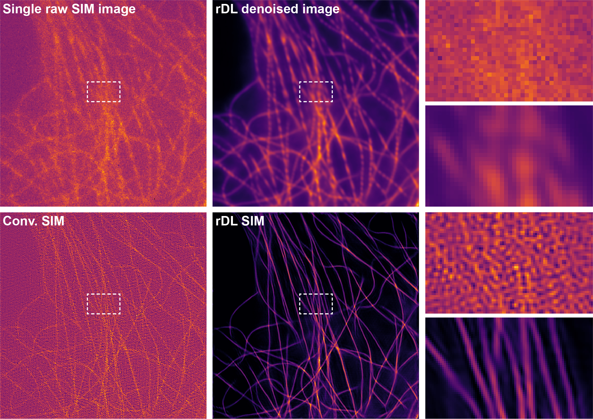

# Rationalized Deep Learning (rDL) for Microscopy Image Denoising 

**rDL denoising software** is a Tensorflow implementation of rationalized deep learning (rDL) based image denoising for microscopy images, e.g., structured illumination microscopy images and lattice light-sheet microscopy images. This repository is developed based on 2022 **Nature Biotechnology** paper *Rationalized deep neural network for sustained super-resolution live imaging of rapid subcellular processes* (DOI:10.1038/s41587-022-01471-3).<br>

Author: Chang Qiao<sup>1,2,#</sup>, Di Li<sup>3,#</sup>, Yong Liu<sup>3,#</sup>, Siwei Zhang<sup>3,4,#</sup>, Kan Liu<sup>1</sup>, Chong Liu<sup>3,4</sup>, Yuting Guo<sup>3</sup>, Tao Jiang<sup>3,4</sup>, Chuyu Fang<sup>5</sup>, Nan Li<sup>6</sup>, Yunmin Zeng<sup>1</sup>, Kangmin He<sup>6,7</sup>, Xueliang Zhu<sup>5</sup>, Jennifer Lippincott-Schwartz<sup>8,+</sup>, Qionghai Dai<sup>1,2,9,10,+</sup>, Dong Li<sup>3,4,+</sup><br>
<sup>1</sup>Department of Automation, Tsinghua University, Beijing, China<br>
<sup>2</sup>Institute for Brain and Cognitive Sciences, Tsinghua University, Beijing, 100084, China<br>
<sup>3</sup>National Laboratory of Biomacromolecules, CAS Center for Excellence in Biomacromolecules, Institute of Biophysics, Chinese Academy of Sciences, Beijing, China<br>
<sup>4</sup>College of Life Sciences, University of Chinese Academy of Sciences, Beijing, China<br>
<sup>5</sup>State Key Laboratory of Cell Biology, Shanghai Institute of Biochemistry and Cell Biology, Center for Excellence in Molecular Cell Science, Chinese Academy of Sciences, University of Chinese Academy of Sciences, Shanghai, China<br>
<sup>6</sup>State Key Laboratory of Molecular Developmental Biology, Institute of Genetics and Developmental Biology, Chinese Academy of Science, Beijing, 100101, China<br>
<sup>7</sup>College of Advanced Agricultural Sciences, University of Chinese Academy of Sciences, Beijing, 100049, China.<br>
<sup>8</sup>Janelia Research Campus, Howard Hughes Medical Institute, Ashburn, VA 20147, USA<br>
<sup>9</sup>Beijing Key Laboratory of Multi-dimension & Multi-scale Computational Photography, Tsinghua University, Beijing, 100084, China<br>
<sup>10</sup>Beijing Laboratory of Brain and Cognitive Intelligence, Beijing Municipal Education Commission, Beijing, 100010, China<br>
<sup>#</sup>Equal contribution<br>
<sup>+</sup>Correspondence to: lippincottschwartzj@janelia.hhmi.org, qhdai@tsinghua.edu.cn and lidong@ibp.ac.cn

## Contents
- [Environment](#environment)
- [File structure](#file-structure)
- [Train your own models](#train-your-own-models)
- [Test pre-trained rDL SIM models](#test pre-trained rDL SIM models)
- [Inferece with TiS/SiS-rDL models](#inferece with TiS/SiS-rDL models)
- [License](#license)
- [Citation](#citation)

## Environment
- Ubuntu 16.04
- CUDA 11.0.207
- cudnn 8.0.4
- Python 3.6.10
- Tensorflow 2.4.0
- GPU: GeForce RTX 3090

## File structure
- `./data_train` is the default path for augmented training data
    - `./data_train/rDL-SIM/SR` the augmented training data for the SR inference module of the rDL SIM model should be place here by default (each training data folder should includes `train`, `train_gt`, `val`, and `val_gt` four subfolders)
    - `./data_train/rDL-SIM/DN` the augmented training data for the rDL denoising module of the rDL SIM model should be place here by default (each training data folder should includes `train`, `train_gt`, `val`, and `val_gt` four subfolders)
    - `./data_train/TiS` the augmented training data for the TiS-rDL denoising model should be place here by default (each training data folder only needs to include `train` and `val` two subfolders here for self-supervised training and validate)
    - `./data_train/SiS` the augmented training data for the SiS-rDL denoising model should be place here by default (each training data folder only needs to include `train` and `val` two subfolders here for self-supervised training and validate)
- `./data_test` is the default path for testing data
    - `./data_test/rDL-SIM` includes a set of raw SIM images of microtubules to test pre-trained rDL SIM models, and other testing data for rDL SIM models should be placed here by default
    - `./data_test/TiS` testing data for TiS-rDL denoising models should be placed here by default
    - `./data_test/SiS` testing data for SiS-rDL denoising models should be placed here by default
- `./src` includes the source codes of rDL SIM, TiS-rDL, and SiS-rDL denoising methods
	- `./src/models` includes declaration of rDL neural network models
	- `./src/utils` is the tool package of rDL software
	- `./src/sim_fitting` includes python scripts of parameter fitting for raw SIM images
- `./trained_models` includes pre-trained rDL models for testing
	- `./trained_models/SR_Inference_Module` includes pre-trained models of the SR inference modules, and newly trained models of SR inference modules will be saved here by default 
	- `./trained_models/rDL_Denoising_Module` includes pre-trained models of the rDL denoising modules, and newly trained models of rDL denoising modules will be saved here by default
	- `./trained_models/rDL_TiS_Denoising_Model` includes trained models of the TiS-rDL denoising method by default
	- `./trained_models/rDL_SiS_Denoising_Model` includes trained models of the SiS-rDL denoising method by default

## Train your own models
- Preparing training dataset. The augmented training data should be placed in the `./data_train` folder, arranged following the file structure described in the above section.
- Open your terminal and cd to `./src`
- Run `bash demo_train_rDL_SIM_Model.sh` in your terminal to train a rDL SIM model which including a SR inference module and a rDL denoising module. 
- Run `bash demo_train_TiS_SiS_Model.sh` in your terminal to train a TiS-rDL model or a SiS-rDL model. 
- Note that before running the bash file, you should check if the data paths and all the arguments in the `.sh` files are set correctly, and you can change the hyperparameters of training, e.g., total training iterations and initial learning rate, in the `.sh` files.

## Test pre-trained rDL SIM models
- Open your terminal and cd to `./src`
- Run `bash demo_predict_rDL_SIM.sh` in your terminal. Note that before running the bash file, you should check if the data paths and other arguments in `demo_predict_rDL_SIM.sh` are set correctly
- The output denoised images will be saved in the same root path of the testing data
- Note that the rDL SIM model only perform raw SIM image denoising, and the final SR image should be generated via the SIM reconstruction algorithm.
- Typical results:<br>
<p align="center"></p>

## Inferece with TiS/SiS-rDL models
- Open your terminal and cd to `./src`
- Run `bash demo_predict_TiS_SiS.sh` in your terminal. Note that before running the bash file, you should check if the data paths and other arguments in `demo_predict_TiS_SiS.sh` are set correctly, and if the trained models and testing data have been placed in the correct folders
- The output denoised images will be saved in the same root path of the testing data

## License
This repository is released under the MIT License (refer to the LICENSE file for details).

## Citation
If you find the code or our dataset helpful in your resarch, please cite the following paper:
```
@article{qiao2022Rationalized,
  title={Rationalized deep neural network for sustained super-resolution live imaging of rapid subcellular processes},       
  author={Chang Qiao, Di Li, Yong Liu, Siwei Zhang, Kan Liu, Chong Liu, Yuting Guo, Tao Jiang, Chuyu Fang, Nan Li, Yunmin Zeng, Kangmin He, Xueliang Zhu, Jennifer Lippincott-Schwartz, Qionghai Dai, Dong Li},
  journal={Nature Biotechnology},
  year={2022},
  publisher={Nature Publishing Group}
}
```
